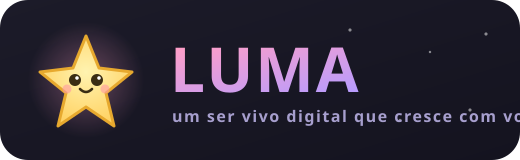

<div align="center">



### Um ser vivo digital que mora no seu computador e cresce com você. 🌙

Companhia • bem-estar • autocuidado • memória viva — **100% offline, 100% seu.**

<br/>

<!-- Badge do projeto -->


<br/>

**Stack**


</div>

---

## ✨ O que é o LUMA

O **LUMA** é um companheiro digital que vive na sua área de trabalho. Você adota
uma criatura, ela **nasce de um ovo**, cresce conforme você cuida de si mesmo, e
constrói com você um **mundo vivo** que reflete a sua jornada — sem números, sem
cobrança, sem julgamento.

É a mistura de **Tamagotchi + Finch + Replika + Animal Crossing**, mas com uma
combinação que ninguém mais junta:

> 🪄 **Ser vivo no desktop + IA 100% local + memória persistente + mundo espelho +
> ética no núcleo.** Tudo offline, privado e seu.

<div align="center">
<br/>
<table>
<tr>
<td align="center" width="33%">🥚<br/><b>Nasce e cresce</b><br/><sub>ovo → bebê → adulto, conforme o cuidado</sub></td>
<td align="center" width="33%">🧠<br/><b>Lembra de você</b><br/><sub>memória viva + IA local (Ollama)</sub></td>
<td align="center" width="33%">🌌<br/><b>Mundo espelho</b><br/><sub>sua jornada vira paisagem</sub></td>
</tr>
<tr>
<td align="center">🌿<br/><b>Autocuidado gentil</b><br/><sub>hábitos, respiração, diário</sub></td>
<td align="center">💛<br/><b>Ponte para ajuda real</b><br/><sub>rede de apoio + CVV/CAPS/SAMU</sub></td>
<td align="center">🔒<br/><b>Privacidade radical</b><br/><sub>tudo local, exportável, apagável</sub></td>
</tr>
</table>
</div>

### O que o LUMA **não** é
Terapia, diagnóstico ou tratamento médico — e nunca substitui um profissional de
saúde, um psicólogo ou um amigo. Ele é **companhia e bem-estar**, e sempre incentiva
a conexão humana real. A camada de segurança ([Safety Layer](docs/07-SAFETY-LAYER.md))
é obrigatória em toda interação com a IA.

---

## 🖼️ Visual

> Personagens em estilo **kawaii vetorial** (corpo inteiro, traços por espécie,
> cor única por personagem). Abra as galerias no navegador:

| Galeria | Arquivo |
|---------|---------|
| 🐾 100 personagens | [`docs/art/catalog-gallery.html`](docs/art/catalog-gallery.html) |
| 🎬 Pet animado (5 estados) | [`docs/art/pet-animated-demo.html`](docs/art/pet-animated-demo.html) |
| 🎨 Estilos de arte | [`docs/art/style-preview.html`](docs/art/style-preview.html) |

<sub>A direção de arte é **híbrida**: vetorial por padrão (escala para 100+), com
caminho para sprites/ilustração ricos via Plugin Engine — ver
[docs/15-ARTE-PIPELINE-HIBRIDO.md](docs/15-ARTE-PIPELINE-HIBRIDO.md).</sub>

---

## 🧩 Funcionalidades

<div align="center">

| | | |
|---|---|---|
| 🏡 **Casa** — pet vivo, reage ao humor | 💬 **Conversa** — IA local com memória | 🌌 **Mundo espelho** — paisagem da jornada |
| 📖 **História** — narrativa contínua | 📓 **Diário** — vira estrelas no mundo | 🌿 **Hábitos** — check-in gentil + streak |
| 🫧 **Respirar** — minigame de calma | 🎣 **Pescar** — minigame cozy | 🎀 **Loja** — skins (fagulhas) |
| 💛 **Apoio** — contatos + recursos de crise | 🏆 **Conquistas** — badges sem punição | ⚙️ **Ajustes** — IA, país, privacidade |

</div>

**Por baixo:** Emotional Context Engine (lê o tom, sem clínica), Memory tiers
(curto/longo/emocional/marco), Growth Engine (ciclo de vida), AI Orchestrator
(escolhe o melhor modelo local pela sua RAM), Plugin Engine (extensível) e mais.

---

## 🚀 Começando

### Pré-requisitos
- [Node.js](https://nodejs.org) 18+ e [pnpm](https://pnpm.io) 9+
- [Rust](https://rustup.rs) (para o app desktop via Tauri)
- _(opcional)_ [Ollama](https://ollama.com) para IA local de verdade

### Rodar o app desktop
```bash
pnpm install
pnpm --filter @luma/desktop tauri dev
```

### IA local (opcional)
```bash
ollama pull phi3:mini      # ou gemma2:2b, llama3.2, qwen2.5, mistral...
# depois, no app: ⚙️ Ajustes → IA local (Ollama) → Testar conexão
```

### Comandos úteis
```bash
pnpm -r test            # roda todos os testes (Vitest)
pnpm -r typecheck       # checagem de tipos
pnpm --filter @luma/characters generate   # (re)gera os 100 personagens
pnpm --filter @luma/characters gallery    # gera a galeria visual
```

---

## 🏛️ Arquitetura

Monorepo **offline-first** com engines de domínio puras (testáveis, reutilizáveis
entre Desktop / Web / Mobile).

```
tamago/
├── packages/
│   ├── shared/      # tipos + contratos (sem I/O, sem framework)
│   ├── core/        # 20+ engines puras: tamagotchi, memory, emotion, growth,
│   │                #   ai, safety, world, narrative, plugin, fishing...
│   ├── characters/  # 100 personagens (gerador) + renderizador SVG
│   └── db/          # schema SQLite + PostgreSQL
└── apps/
    └── desktop/     # Tauri + React + Zustand + Tailwind (app nativo)
```

📚 **Documentação completa** em [`docs/`](docs/):
[Arquitetura](docs/01-ARQUITETURA.md) ·
[Roadmap](docs/02-ROADMAP.md) ·
[Banco de dados](docs/03-BANCO-DE-DADOS.md) ·
[Memory Engine](docs/06-MEMORY-ENGINE.md) ·
[Safety Layer](docs/07-SAFETY-LAYER.md) ·
[Estado atual](docs/00-CURRENT-STATE.md) ·
[Plano de implementação](docs/00-IMPLEMENTATION-PLAN.md)

### Princípios inegociáveis
1. **Offline-first** — funciona 100% sem internet.
2. **Sem barras** — o estado é *sentido* (luz, clima, animação), não lido em números.
3. **Sem culpa, sem manipulação** — o pet nunca usa "você me abandonou".
4. **Privacidade radical** — dados locais, exportáveis e apagáveis.
5. **Ética no núcleo** — a Safety Layer envolve toda I/O da IA.

---

## 🤝 Contribuindo

Toda ajuda é bem-vinda — de código a arte, de ideias a tradução. Leia o guia
completo em **[CONTRIBUTING.md](CONTRIBUTING.md)**.

**Formas de contribuir:**
- 🎨 **Criar personagens ou sprites** (o Plugin Engine aceita packs!)
- 🐛 **Reportar bugs** ou sugerir features via [Issues](../../issues)
- 💻 **Código** — pegue uma issue marcada `good first issue`
- 🌍 **Tradução** e acessibilidade
- 📖 **Documentação**

> 💗 Este é um projeto de **bem-estar**. Pedimos que toda contribuição respeite a
> filosofia do LUMA: gentileza, privacidade e nada que substitua ajuda profissional.

---

## 🗺️ Roadmap

- [x] **Fase 1** — Desktop Pet + Character + Mood
- [x] **Fase 2** — Chat + IA Local + Memory
- [x] **Fase 3** — Relationship + World + Hábitos + Crescimento
- [x] **Sprints A–D** — Emoção, Memória em camadas, Narrativa, Eventos, AI Orchestrator, Plugin Engine
- [ ] **Fase 4** — Web sincronizada + Backend + Sync
- [ ] **V2** — Família do pet (moradores), Mobile, galeria comunitária

Detalhes em [docs/02-ROADMAP.md](docs/02-ROADMAP.md) e [docs/14-ROADMAP-UNIFICADO.md](docs/14-ROADMAP-UNIFICADO.md).

---

## 📜 Licença & Crédito

Código sob licença **MIT** (ver [LICENSE](LICENSE)). Conteúdo de terceiros, quando
reutilizado, é creditado em [NOTICE](NOTICE).

<div align="center">
<br/>
<sub>Feito com 💗 para fazer companhia.</sub><br/>
<sub><b>LUMA não substitui ajuda profissional.</b> Em crise no Brasil, ligue para o <b>CVV: 188</b> (24h, gratuito).</sub>
</div>
